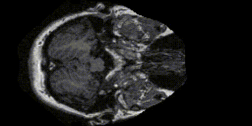
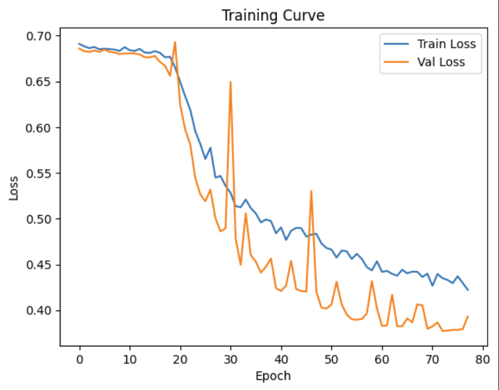
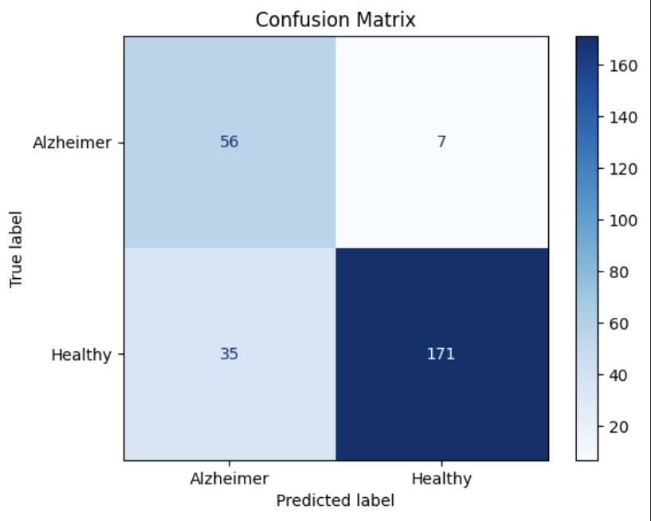

# Alzheimer MRI Volume Classifier


This project implements a deep learning pipeline for classifying Alzheimer's disease from 3D MRI brain scan volumes. The workflow includes data preprocessing, 3D volume construction, model training, and evaluation. 

## Dataset
- [OASIS Alzheimer's Detection](https://www.kaggle.com/datasets/ninadaithal/imagesoasis)

## Project Structure

- `volume_metadata.csv` - Metadata for all volumes
- `train_volume.csv`, `val_volume.csv` - Train/validation splits
- `best_model.pt` - Saved best model weights
- `volume_classifier.ipynb` - Main notebook for data processing, model training, and evaluation
- `visualize.py` - Script to visualize 3D MRI volumes using napari
- `download.sh` - Script to download dataset

## Main Steps

1. **Data Preparation**
   - Slices are grouped into 3D volumes per subject.
   - Volumes are saved as `.pt` files and metadata is stored in CSVs.

2. **Dataset and DataLoader**
   - Custom PyTorch `Dataset` loads 3D volumes and labels from CSVs.
   - Data is split into training and validation sets.

3. **Model**
   - A small 3D CNN is defined for binary classification (Alzheimer vs. Healthy).
   - Optionally, a pretrained 3D ResNet can be used.

4. **Training**
   - Weighted cross-entropy loss to handle class imbalance.
   - Training loop with early stopping and learning rate scheduling.
   - Best model is saved automatically.

5. **Evaluation**
   - Classification report and confusion matrix are generated on the validation set.
   - Training/validation loss curves are plotted.

6. **Visualization**
   - Use `visualize.py` to inspect 3D MRI volumes interactively with napari.

## Results




| Class        | Precision | Recall | F1-score | Support |
|--------------|-----------|--------|----------|---------|
| **Alzheimer**| 0.62      | 0.89   | 0.73     | 63      |
| **Healthy**  | 0.96      | 0.83   | 0.89     | 206     |
|              |           |        |          |         |
| **Accuracy** |           |        | **0.84** | 269     |
| **Macro avg**| 0.79      | 0.86   | 0.81     | 269     |
| **Weighted avg** | 0.88  | 0.84   | 0.85     | 269     |

## Requirements

Install dependencies with:

```bash
pip install torch torchvision scikit-learn pandas matplotlib tqdm pillow napari
```

## Usage

1. **Download Data**
   - Download the dataset using the bash script

1. **Preprocess Data**
   - Run the notebook cells up to the preprocessing section to generate 3D volumes and metadata.

2. **Train Model**
   - Continue running the notebook to train the 3D CNN and monitor loss curves.

3. **Evaluate**
   - The notebook will output classification metrics and confusion matrix.

4. **Visualize Volumes**
   - Run `python visualize.py` to open a napari viewer for a sample MRI volume.